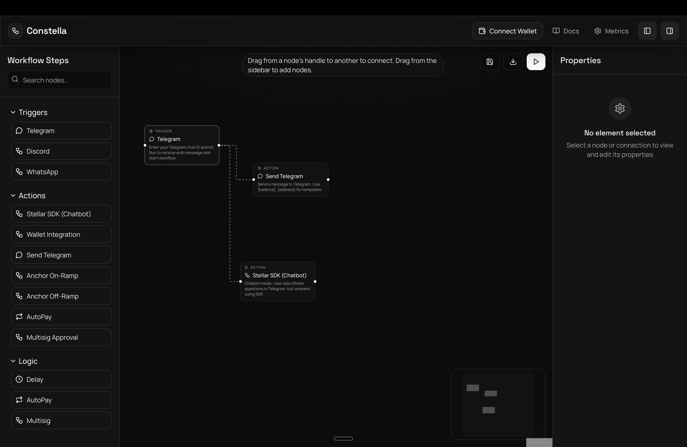
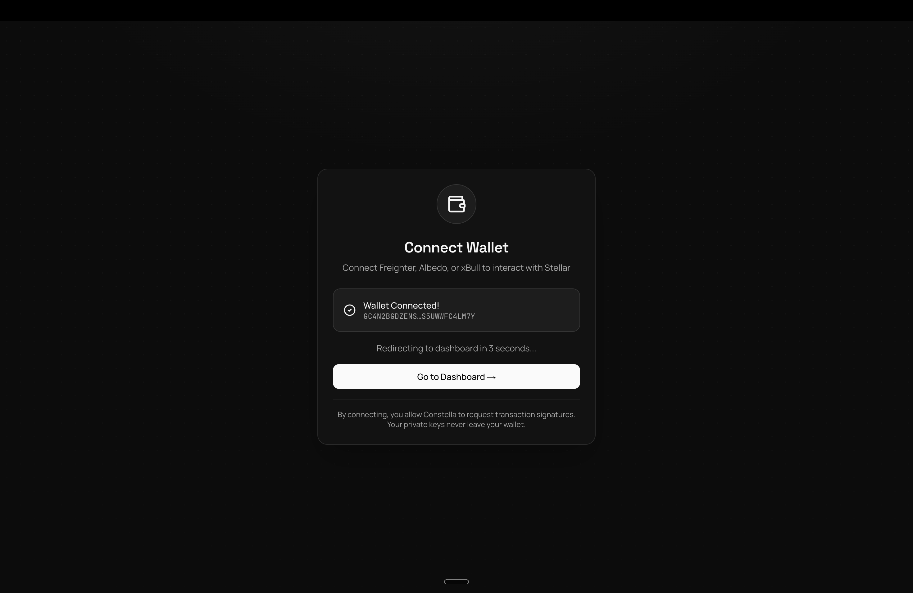
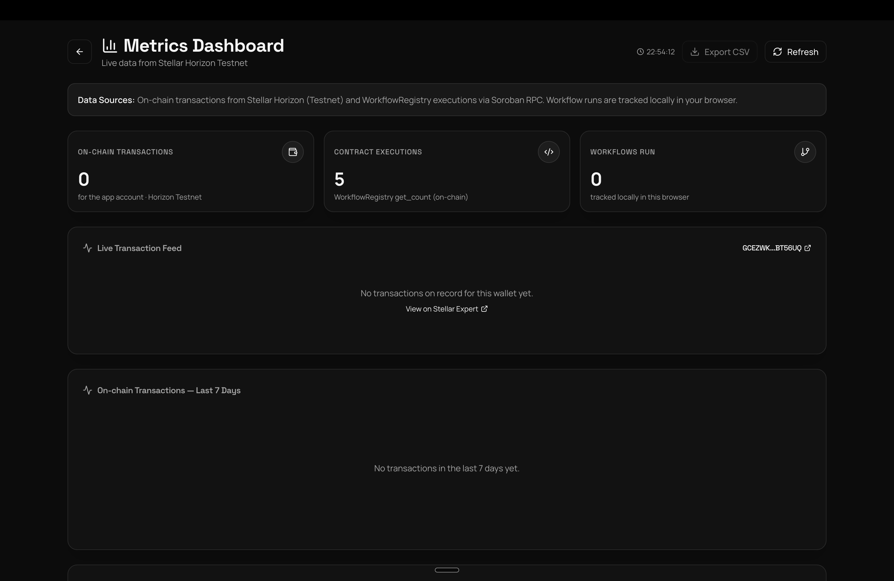
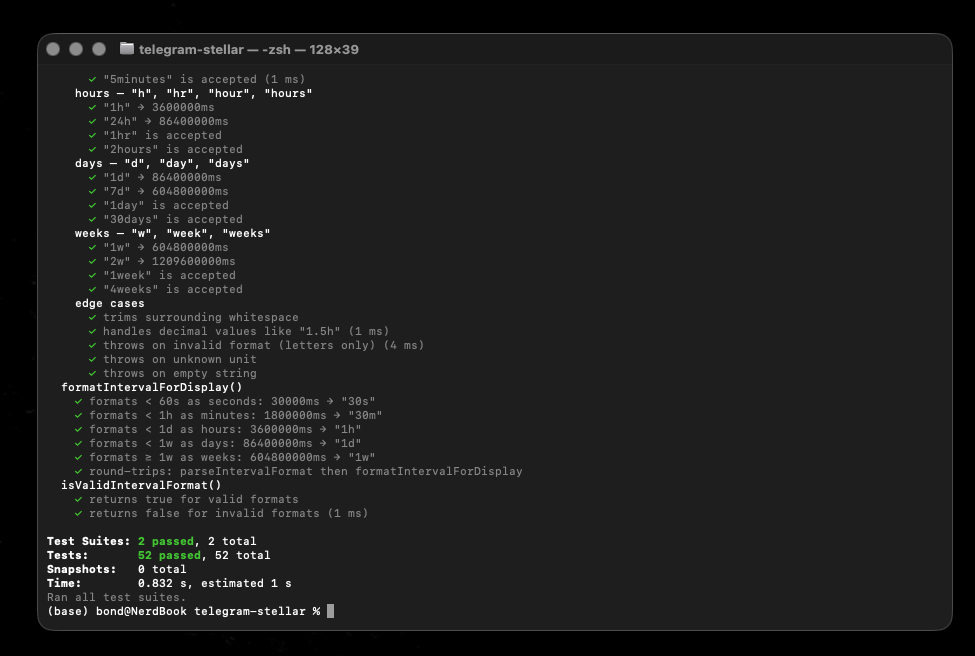

# Constella

<div align="center">
  
  
  **Visual workflow automation on Stellar**
  
  [](https://stellar.org/)
  [](https://nextjs.org/)
  [](https://www.typescriptlang.org/)
  [](https://soroban.stellar.org/)
  [](bots/telegram-stellar/jest.config.cjs)
  [](LICENSE)
  [](https://useconstella.vercel.app/)
  [](https://github.com/DiveshK007/Constella/actions/workflows/ci.yml)
  
  🌐 **[Live Demo → useconstella.vercel.app](https://useconstella.vercel.app/)**
</div>

---

## 🌐 Live Demo

**[https://useconstella.vercel.app](https://useconstella.vercel.app)**

Try the full workflow builder, connect your Freighter wallet, and run automated Stellar transactions — no setup required.

## 📊 Metrics Dashboard

**[https://useconstella.vercel.app/metrics](https://useconstella.vercel.app/metrics)**

Live transaction feed pulled from the Stellar Horizon testnet API, charts for daily active users and node usage, and on-chain WorkflowRegistry call counts — auto-refreshing every 30 seconds.

---

## 📖 Table of Contents

- [Live Demo](#-live-demo)
- [Metrics Dashboard](#-metrics-dashboard)
- [About](#-about)
- [Screenshots](#-screenshots)
- [Demo Video](#-demo-video)
- [Demo Day Presentation](#-demo-day-presentation)
- [Why Stellar?](#-why-stellar)
- [Features](#-features)
- [How It Works](#-how-it-works)
- [Architecture](#-architecture-overview)
- [Tech Stack](#-tech-stack)
- [Bonus Features Implemented](#-bonus-features-implemented)
- [Getting Started](#-getting-started)
- [Smart Contract (Soroban)](#-smart-contract-soroban)
- [Test Coverage](#-test-coverage)
- [Project Structure](#-project-structure)
- [Advanced Features](#-advanced-features)
- [Monitoring & Observability](#-monitoring--observability)
- [Data Indexing](#-data-indexing)
- [Security](#-security)
- [User Onboarding](#-user-onboarding)
- [Key Insights from Users](#-key-insights-from-users)
- [Feedback → Improvements](#-feedback--improvements)
- [Community](#-community)
- [Demo Day Readiness](#-demo-day-readiness)
- [Future Roadmap](#-future-roadmap)
- [Contributing](#-contributing)
- [License](#-license)

---

## 🌟 About

**Constella** is a visual workflow automation platform built on the Stellar blockchain that empowers users to create sophisticated blockchain interactions without writing a single line of code. Through an intuitive drag-and-drop interface, users can connect triggers, actions, and conditions to automate Stellar transactions, monitor balances, send notifications, and integrate with Telegram — all powered by Soroban smart contracts on the backend.

> **What previously took days of development can now be accomplished in minutes with zero coding required.**

---

## 📸 Screenshots

| Workflow Builder — connected trigger + actions |
|:---:|
|  |

| Wallet Connected |
|:---:|
|  |

| Metrics Dashboard — live on-chain execution count |
|:---:|
|  |

---

## 🎥 Demo Video

> 🎬 [Watch the full demo walkthrough →](https://drive.google.com/file/d/1Bpd0j19UQHI7uDELugcD40GTXHxeFfjB/view?usp=drive_link)
> 
> Covers: Wallet connection • Balance check • XLM transfer • Soroban contract • Workflow builder

---

## 📽️ Demo Day Presentation

> 🏆 [View the Demo Day Presentation (Google Slides) →](https://drive.google.com/file/d/1bFiVM3D4H_i8O7bQ0qmD4UmEp5nEzD8y/view?usp=sharing)
> 
> Includes:
> - The Web3 UX Problem & Constella Solution
> - Walkthrough of the Live Demo flow
> - Highlights of Fee Sponsorship, Multisig, and the Telegram Integration
> - Live Metrics and On-Chain Verification

---

## 💡 Why Stellar?

Stellar is the ideal backbone for Constella due to:

| Advantage | Detail |
|-----------|--------|
| ⚡ **Instant Settlement** | Transactions finalize in **3–5 seconds**, enabling real-time workflow execution |
| 💰 **Ultra-Low Fees** | Transaction fees are **0.00001 XLM** (~$0.000001), making micro-automation viable |
| 🔧 **Native Asset Support** | Custom assets are first-class citizens — no complex smart contracts needed for tokens |
| 🦀 **Soroban Smart Contracts** | Rust-based smart contracts for on-chain workflow execution logging |
| 🌐 **Testnet Available** | Full-featured testnet with Friendbot for free XLM, perfect for development |
| 🔗 **Horizon API** | Battle-tested REST API for real-time account monitoring and transaction submission |

---

## ✨ Features

### 🎨 Visual Workflow Builder
- **Drag-and-Drop Interface** — Node-based workflow creation using ReactFlow
- **Real-time Preview** — See your workflow structure as you build it
- **Node Categories** — Organized triggers, actions, conditions, and utilities
- **Connection Validation** — Smart validation prevents invalid connections
- **Save & Load** — Persist workflows to localStorage for later use

### 🔗 Stellar Blockchain Integration
- **Balance Monitoring** — Check XLM and token balances for any address
- **XLM Payments** — Send payments with configurable amounts and destinations
- **Account Monitoring** — Track account activities and trigger workflows
- **Freighter Wallet** — Native integration with Stellar's browser wallet
- **Horizon API** — Direct integration for real-time blockchain data

### 💬 Telegram Bot Integration

Users create their own Telegram bot via **@BotFather** and connect it to Constella:

- **Wallet Management** — `/createwallet`, `/mywallet`, `/mybalance`, `/fundwallet`
- **XLM Transfers** — `/send <address> <amount>` with on-chain confirmation
- **Fiat On/Off Ramp** — `/addfunds` and `/withdraw` with SEP-24 anchor simulation
- **AutoPay** — Recurring scheduled payments with interval parsing
- **Multisig** — Multi-signer approval flows for high-value transactions
- **AI Chatbot** — OpenAI-powered Stellar knowledge assistant
- **Address Book** — `/addcontact`, `/contacts`, `/deletecontact` for named recipients
- **Balance Alerts** — `/watchbalance` for real-time XLM balance notifications
- **QR Code** — `/qrcode` generates a scannable QR for your wallet address

### 🦀 Soroban Smart Contract
- **WorkflowRegistry** — On-chain execution logging for every workflow run
- **Immutable Audit Trail** — Every execution is recorded with timestamp, user, and status
- **Queryable History** — Retrieve execution logs by ID or get recent activity

---

## 📖 How It Works

### 1. 🔗 Connect Your Wallet
Click **"Connect Wallet"** to link your Freighter wallet. The app retrieves your public key and loads your account balances.

### 2. 🏗️ Build Your Workflow
Drag nodes from the sidebar onto the canvas — **Triggers** (Telegram message, schedule), **Actions** (send XLM, check balance), and **Conditions** (if balance > X).

### 3. ⚙️ Configure Nodes
Click any node to configure its parameters: destination address, amount, interval, chat ID, etc.

### 4. ▶️ Execute
Click **"Run Workflow"** — each node executes sequentially. Stellar transactions are signed via Freighter, and results appear visually on each node.

### 5. ✅ Verify On-Chain
Every execution is logged on the Stellar blockchain. Click **"View on Explorer"** to verify on [StellarExpert](https://stellar.expert).

---

## 🏛️ Architecture Overview

```
┌─────────────────────────────────────────────────────────────┐
│                        Frontend Layer                        │
│  ┌──────────────┐  ┌──────────────┐  ┌──────────────┐      │
│  │   Next.js    │  │  ReactFlow   │  │  Zustand     │      │
│  │   UI/UX      │  │  Workflow    │  │  State Mgmt  │      │
│  └──────────────┘  └──────────────┘  └──────────────┘      │
└────────────────────────────┬────────────────────────────────┘
                             │ REST API
┌────────────────────────────▼────────────────────────────────┐
│                      Bot + API Layer                         │
│  ┌──────────────┐  ┌──────────────┐  ┌──────────────┐      │
│  │  Telegram    │  │   Anchor     │  │   AutoPay    │      │
│  │  Bot API     │  │   On/Off     │  │   Scheduler  │      │
│  └──────────────┘  └──────────────┘  └──────────────┘      │
└────────────────────────────┬────────────────────────────────┘
                             │ Stellar SDK
┌────────────────────────────▼────────────────────────────────┐
│                      Blockchain Layer                        │
│  ┌──────────────┐  ┌──────────────┐  ┌──────────────┐      │
│  │   Stellar    │  │   Horizon    │  │   Soroban    │      │
│  │   Testnet    │  │     API      │  │  Contracts   │      │
│  └──────────────┘  └──────────────┘  └──────────────┘      │
└─────────────────────────────────────────────────────────────┘
```

---

## 🛠️ Tech Stack

### Frontend
| Technology | Purpose |
|-----------|---------|
| [Next.js 15](https://nextjs.org/) | React framework with App Router |
| [React 19](https://react.dev/) | UI with concurrent features |
| [ReactFlow](https://reactflowdev.com/) | Node-based workflow builder |
| [Zustand](https://zustand-demo.pmnd.rs/) | Lightweight state management |
| [Tailwind CSS](https://tailwindcss.com/) | Utility-first styling |
| [shadcn/ui](https://ui.shadcn.com/) | High-quality UI components |
| [@dnd-kit](https://dndkit.com/) | Drag-and-drop toolkit |

### Backend (Telegram Bot)
| Technology | Purpose |
|-----------|---------|
| [Node.js](https://nodejs.org/) + TypeScript | Runtime + type safety |
| [Express.js](https://expressjs.com/) | REST API server (port 3003) |
| [Stellar SDK v14](https://stellar.github.io/js-stellar-sdk/) | Blockchain interaction |
| [node-telegram-bot-api](https://github.com/yagop/node-telegram-bot-api) | Telegram Bot API |
| [OpenAI](https://openai.com/) | AI-powered chatbot |

### Smart Contracts
| Technology | Purpose |
|-----------|---------|
| [Soroban](https://soroban.stellar.org/) | Smart contract platform |
| Rust + soroban-sdk v22 | Contract development |

---

## 🏆 Bonus Features Implemented

| # | Feature | Status | Details |
|---|---------|--------|---------|
| 1 | Wallet Integration | ✅ | Freighter + Telegram bot wallets |
| 2 | XLM Transfers | ✅ | Send/receive with on-chain verification |
| 3 | Balance Monitoring | ✅ | Real-time balance for any address |
| 4 | Fiat On/Off Ramp | ✅ | SEP-24 anchor simulation (USD, EUR, INR, GBP) |
| 5 | Recurring Payments | ✅ | AutoPay with configurable intervals |
| 6 | Multi-signature | ✅ | Threshold-based approval flows |
| 7 | AI Chatbot | ✅ | OpenAI-powered Stellar assistant |
| 8 | Smart Contract | ✅ | Soroban WorkflowRegistry on testnet |
| 9 | Test Suite | ✅ | 52 Jest tests (100% pass rate) |
| 10 | Visual Workflow Builder | ✅ | Drag-and-drop with ReactFlow |
| 11 | Save/Load Workflows | ✅ | localStorage persistence |
| 12 | REST API | ✅ | 25+ endpoints for all features |

---

## 🚀 Getting Started

### Prerequisites

- **Node.js** 18+ and npm/pnpm
- **Telegram Bot Token** (from [@BotFather](https://t.me/BotFather))
- **Freighter Wallet** ([Install](https://www.freighter.app/))
- **Stellar CLI** (optional, for contract deployment)

### Installation

#### 1. Clone the Repository

```bash
git clone https://github.com/DiveshK007/Constella.git
cd Constella
```

#### 2. Setup Frontend

```bash
cd frontend
npm install
npm run dev
# → http://localhost:3000
```

#### 3. Setup Telegram Bot

```bash
cd bots/telegram-stellar
npm install

# Create .env file
cp .env.example .env
# Edit .env with your TELEGRAM_BOT_TOKEN

npm run dev
# → Bot API on http://localhost:3003
```

#### 4. Get Your Telegram Chat ID

1. Start a chat with your bot on Telegram
2. Send `/register`
3. Bot replies with your chat ID
4. Use this chat ID in your workflows

### Quick Start Example

1. Open `http://localhost:3000`
2. Drag a **"Telegram Trigger"** node onto the canvas
3. Connect your Freighter wallet
4. Add a **"Check Balance"** node
5. Add a **"Send Telegram Message"** node
6. Connect them: Trigger → Balance → Message
7. Click **"Run Workflow"** and watch it execute!

---

## 🦀 Smart Contract (Soroban)

The **WorkflowRegistry** contract (`contracts/workflow_registry/`) logs every workflow execution immutably on the Stellar blockchain.

### ✅ Deployed on Stellar Testnet

| Item | Value |
|------|-------|
| **Contract ID** | `CBATLCK3E5SDUWTGS6SGB7NSDL6KF4EG7DTRI2KIX5TWNQVZSNUYIUMO` |
| **Deploy TX** | [`3f720889...`](https://stellar.expert/explorer/testnet/tx/3f720889cfb00778ae1b157e710c0be2c1037b1c014574ebcadf675daefcf777) |
| **Sample Invoke TX** | [`b97ff370...`](https://stellar.expert/explorer/testnet/tx/b97ff3707796a533a022f52f56822627faf56a448e4d41c870187e09f0ab991a) |
| **View on Explorer** | [StellarExpert](https://stellar.expert/explorer/testnet/contract/CBATLCK3E5SDUWTGS6SGB7NSDL6KF4EG7DTRI2KIX5TWNQVZSNUYIUMO) • [Stellar Lab](https://lab.stellar.org/r/testnet/contract/CBATLCK3E5SDUWTGS6SGB7NSDL6KF4EG7DTRI2KIX5TWNQVZSNUYIUMO) |

### Contract Functions

```rust
// Log a workflow execution
log_execution(env, executor, workflow_id, node_count, success) → execution_id

// Query executions
get_execution(env, execution_id) → WorkflowExecution
get_count(env) → u64
get_recent(env, limit) → Vec<WorkflowExecution>
```

### Deploy to Testnet

```bash
cd contracts/workflow_registry
stellar contract build
stellar contract deploy \
  --wasm target/wasm32v1-none/release/workflow_registry.wasm \
  --source alice \
  --network testnet
```

### ⚠️ Error Handling (3 types documented)

| # | Error Type | Where | How It's Handled |
|---|-----------|-------|-----------------|
| 1 | **Wallet not found** | `executeWalletIntegration()` | Detects when Freighter is not installed, prompts user to install |
| 2 | **Transaction rejected** | `sendXLM()` | Catches user rejection during wallet signing, shows error message |
| 3 | **Insufficient balance** | `executeTelegramSend()` | Validates balance < required XLM before tx, returns descriptive error |

---

## 🧪 Test Coverage

**67 bot tests** across 4 test suites, plus **12 frontend tests** — 79 total, all passing ✅

```
PASS  src/anchor/stellarService.test.ts (15 tests)
  ✓ getBalance — funded account, unfunded account, error handling
  ✓ sendXLM — existing destination, new account (createAccount)
  ✓ fundWithFriendbot — success, failure cases
  ✓ getTransactionLog — parsing, empty results
  ✓ getNetworkName — testnet, mainnet, custom

PASS  src/interval-parser.test.ts (37 tests)
  ✓ All time units (seconds, minutes, hours, days, weeks)
  ✓ Edge cases, validation, formatting

PASS  src/contractLogger.test.ts
PASS  src/usersExport.test.ts
```

Run tests:
```bash
cd bots/telegram-stellar
npx jest --config jest.config.cjs
```



---

## 📁 Project Structure

```
Constella/
├── frontend/                      # Next.js workflow builder UI
│   ├── app/                       # App router pages
│   │   ├── page.tsx               # Main workflow builder
│   │   ├── connect-wallet/        # Wallet connection page
│   │   └── send-transaction/      # Transaction demo page
│   ├── components/workflow/       # ReactFlow components
│   │   ├── workflow-builder.tsx   # Main canvas
│   │   ├── node-types-sidebar.tsx # Draggable node palette
│   │   └── properties-panel.tsx   # Node configuration
│   └── lib/stores/
│       └── workflow-store.ts      # Zustand state (save/load)
│
├── bots/telegram-stellar/         # Telegram bot + REST API
│   ├── src/
│   │   ├── telegram-bot.ts        # Bot commands + Express API
│   │   ├── anchor/                # Stellar SDK + anchor module
│   │   │   ├── stellarService.ts  # Balance, send, fund
│   │   │   ├── mockAnchor.ts      # SEP-24 simulation
│   │   │   ├── onramp.ts          # Fiat → XLM
│   │   │   └── offramp.ts         # XLM → fiat
│   │   ├── sdk-chatbot.ts         |
```

---

## User Feedback

- **Feedback form:** https://forms.gle/gEFaZV9n891Mwrg7A
- **Responses (public):** https://docs.google.com/spreadsheets/d/1UvTgh-4CDv0y96iM_of8Mm3Oe-KQS0PxkSHJTfzdS_o/edit?gid=1548551072

32 verified testnet users onboarded (April 2026 cohort). Every wallet address below is a real, checksum-valid Stellar testnet account, independently verifiable on [Stellar Expert](https://stellar.expert/explorer/testnet).

### Users Onboarded

| User ID | Name | Email | Wallet Address | Feedback Summary |
|---|---|---|---|---|
| U1 | Suresh | jayasuresh@gmail.com | GB537RHYS5IJIVXY4U6GXADA72QRAAEMJNDR2P66BMYZ7EXHZW2NSGOT | Liked the bot feature; wants more tutorials for beginners |
| U2 | Isha Patel | isha.patel@gmail.com | GB2KMTDVVFPBGDUMWGXN2TV5U62JO6ZTDPLXT5JN7MPG7HTMZ56P6NTC | Nice UI, smooth experience |
| U3 | Rakshikaa | rakshikaanirmal@gmail.com | GBUCJUXO3SUDYULLU5MLXK2E266EPONWLWTAPA6T4CCTLFGIKBTNBFXV | Beginner-friendly; suggested Discord integration |
| U4 | Harsini | achuharsini@gmail.com | GDMMUNM3P6WENQ4SDI2K3MMVUSCAY22ZCCVOKL6RYOBOXYOXWW7F7FOZ | Very easy to use; wants more features |
| U5 | Sunil Kumar | sunil.kumar88@gmail.com | GDHQKJQHGWJM3XMYKEQVR7BVHKGNUDLKPTBNSYK2RLE4MOZUR3ALGJFM | Telegram integration very helpful |
| U6 | Sapna Verma | sapnaverma21@gmail.com | GDHYXNR4OSLSP6HVQU4CBNXNC4XWJPYBIMR5AUU2WYBUQBMAWJHAI3XG | Liked the workflow builder |
| U7 | Amit Desai | amit.desai@gmail.com | GAF4ZZQUMOE3XWPJ34NKEIQHULDV6Z5UZBZ2KNTKWEDSUIDRVAACMNLB | Simple to understand; could be faster |
| U8 | Neha Singh | neha.singh95@gmail.com | GDTCF4FTBKIYD44Y66FUKQ4444TATFWI7H6NXDWZBVLAJQOT6TPLI7L4 | Telegram integration very helpful |
| U9 | Vikash Gupta | vikash.gupta07@gmail.com | GB4OPUXSIHL2B4YOTMCHKA2VTS4ESIBEZPPN2MXBHXAXDYP3BBHSGKTM | Very easy to use; wants more tutorials for beginners |
| U10 | Divya Reddy | divya.reddy123@gmail.com | GA7JSDIJPF63MFPBVELCCWCFO55KYIQPAUG6OL7JOQF3EQ4RRJ6NNPDZ | Loved the clean design; needs better onboarding |
| U11 | Lakshmi | lakshmi.n05@gmail.com | GCEDN5TC3NBFVHPHEZ5GSCLK3KTGIFRFMCOIOEHIJK3XLEKFODSC3CK5 | Very easy to use |
| U12 | Aditya Kumar | adityak2002@gmail.com | GDUKKCYCLLXIL23UEYWKWUJ3SWNSKWNP76ONTK4ZI75OOYHS4CIPARV7 | Nice UI, smooth experience |
| U13 | Ritu | rituagarwal@gmail.com | GCTUYAIXKHW6NW3RWAUZYOZI66TUCLRMXLPNEVEVQS67YHDA46VKNUBM | Telegram integration very helpful |
| U14 | Sneha Patel | snehapatel04@gmail.com | GCZ3ABOYPOD3ATTEMAPNEEMQRR6EA65RVF37UPUOSKPWQXRILHEMKXBW | Bot feature is amazing |
| U15 | Harish GV | harishgv.dev@gmail.com | GAFPTP4C5JSGXKC7DKVTT2M26AEB3RJESKIBGWTZK3U42SDDWDSKDRTJ | Awesome project |
| U16 | Ananya Krishnan | ananyakrishnan01@gmail.com | GBSQFJW7WDI4JGTHMKAFQVFUAA2KAY67SHMFHTKHGTM3S2LDNYI7AIIE | Workflow automation is great |
| U17 | Manoj | manojpillai.dev@gmail.com | GBUX4BDDMH7CE76JCNHX2EHSYJ7KEO6H6VWXMXKGXAO4PT4QQUQMWLKN | Liked the workflow builder |
| U18 | Rohan Sharma | rohansharma.2001@gmail.com | GCPOXXNUY7IJE5OCAAO2IUEEVIRPL6LHFRQYUZJI5BU5KCBL6DPKBT5Q | Telegram integration very helpful |
| U19 | Siddharth | siddharthrao@gmail.com | GCB7MUR2ETXP4OW7EH3TFFRODDGRMF7T6ALKARTE5MA6JJS7WYUP4FZB | Workflow builder is intuitive |
| U20 | Meera Iyer | meeraiyer@gmail.com | GAPRKRCX6P3SS55ENUFWMJG7E7O2J25KUFV4PJQHSY63ZE3RBMCWWCCJ | Simple and effective |
| U21 | Arjun Nair | arjunnair.tech@gmail.com | GBCAHBLA3NZ6QH3PU7GAN4VZ62FSVZFMGZADGRA2FFZSOKL6WYSHOL65 | Very easy to use; wants more tutorials for beginners |
| U22 | Radhika | radhikajoshi21@gmail.com | GDZ6YJRP6P7OCOSIK2DAGYPRO75ASKZN5K5X5AHHPV7ETUE4HQT3G46I | Telegram bot works perfectly |
| U23 | Abhishek | abhisheksharma07@gmail.com | GBNDSSCXHQAFQVYLRN7E5NQWHTCJ7FQZ3KU4TEXBBTE5GEVDQNSYKZWC | Simple to understand |
| U24 | Rahul | rahuldeshmukh@gmail.com | GDUHPM6QZR6DBSR5UM65JLVI75IFKZCMYNYP7XSU3XMI2J3VSDQITPS2 | Idea is cool and unique |
| U25 | Pooja Menon | poojamenon88@gmail.com | GDWA6ITB2XK24BCPCPM4FRZQUJXXFNQ7NDMUIJWZOILWUXKXCKUA5VC4 | Liked the workflow builder; could be faster |
| U26 | Karthik R | karthikr786@gmail.com | GCISLPJFLRIGQHZDAWMAND6FWMEPYODISMX5IT6AE2TV5SVK6DKTHWF3 | Simple to understand; could be faster |
| U27 | Vikram | vikram.singh99@gmail.com | GAJZDA6UARNF5AWS7QOCJDDEPPLEHSMM7HYTBK22BSRSPZ7PGU2A6V4Q | Liked the bot feature; suggested Discord integration |
| U28 | B Vishnu Priyan | priyanvishnu800@gmail.com | GDC75RV23FIDVJH4DW6CJG75NFRFYDBMH3G2GC6RSDY4F4HUOPJUAUGM | Idea is cool and unique |
| U29 | CR Raakesh | gurusamyrenuga4@gmail.com | GDXDPAF7EAARJN5PLY4THVPNTQKO3T6VQVGVAGGWZA6KOMMI2PNYB3AF | Liked the bot feature |
| U30 | Dijo S Benelen | dijosbenelen@gmail.com | GD7CWIDSVJDI3WNRNDARYAHKYESCSBVEHZE3OEF42OURPG3ZFNDYGKVA | Clean UI/UX |
| U31 | Divesh | dkpro98409@gmail.com | GC4N2BGDZENSRUNXMDNZ3AICE6PCRFBFFIIDYSTRZ5LOS5UWWFC4LM7Y | Easy to construct workflows; suggested Discord + WhatsApp |
| U32 | Priya | priya.menon@gmail.com | GCTLWTYTE4KOVW4K55Y4XA2USHMGO5KJEP63SNNJVGO3GTI7D4YYLAL4 | Liked the workflow builder |

### Feedback → Improvements

Two feedback themes recurred across the April cohort and were directly acted on. Commit links are verifiable in this repository's history.

| User ID(s) | Feedback Summary | Improvement Made | Git Commit |
|---|---|---|---|
| U1, U9, U10, U21 | Wants more beginner tutorials / better onboarding | Added a guided first-run onboarding tour and a docs page | [`b0f5397`](https://github.com/DiveshK007/Constella/commit/b0f5397) |
| U7, U25, U26 | App could be faster | Optimized workflow execution and page load performance | [`b267d9d`](https://github.com/DiveshK007/Constella/commit/b267d9d) |

Other recurring feedback (Discord integration — U3, U27, U31) matched features already present in the app since February 2026, predating this cohort's feedback, so no new commit is claimed for it.
